# DevOps Practical Examination

This repository contains the work completed for the DevOps practical examination.

## Project Structure

- `frontend/index.html`: A simple HTML web page containing a heading, paragraph, repository link, and button.
- `backend/main.py`: FastAPI backend application.
- `backend/requirements.txt`: Python dependencies for the backend.
- `Dockerfile`: Container image definition for the application.

## Question 1: Initialize a Git Repository and Push Code to GitHub

### Commands Used

```bash
git init
git add .
git commit -m "Initial commit: add index.html page"
git branch -M main
git remote add origin https://github.com/YOUR_USERNAME/YOUR_REPOSITORY.git
git push -u origin main
```

### Explanation

First, I initialized a Git repository using `git init`. Then I added all project files using `git add .` and committed them with a proper commit message. After that, I renamed the branch to `main`, connected the local repository to GitHub using `git remote add origin`, and pushed the code to GitHub using `git push -u origin main`.

### Example Commit Message

```bash
Initial commit: added index.html page
```

## Question 2: Create a Branching Strategy and Simulate Team Workflow

### Branching Strategy

- `main`: Stable production branch.
- `develop`: Integration branch where completed features are merged.
- `feature`: Branch used by a developer to work on a new feature.

### Commands Used

```bash
git branch develop
git checkout develop

git checkout -b feature/update-homepage
git add .
git commit -m "Update homepage content"

git checkout develop
git merge feature/update-homepage

git checkout main
git merge develop

git push origin main
git push origin develop
git push origin feature/update-homepage
```

### Explanation

First, I created a `develop` branch from `main`. Then I created a feature branch named `feature/update-homepage` from `develop` to simulate a developer working on a new feature. After completing the work, I committed the changes and merged the feature branch into `develop`. Finally, I merged `develop` into `main` to simulate releasing stable code.

## Question 3: Resolve a Merge Conflict Scenario and Document the Steps Taken

### Scenario

A merge conflict was created by editing the same heading line in `index.html` on two different branches:

- `conflict-change-a`
- `conflict-change-b`

### Commands Used

```bash
git checkout -b conflict-change-a
git add index.html
git commit -m "Update heading from first conflict branch"

git checkout main
git checkout -b conflict-change-b
git add index.html
git commit -m "Update heading from second conflict branch"

git checkout main
git merge conflict-change-a
git merge conflict-change-b
```

The second merge created a conflict in `index.html`.

### Conflict Resolution Steps

```bash
git status
```

I opened `index.html`, removed the conflict markers, and kept the final correct heading:

```html
<h1>Welcome to My DevOps Practical Website</h1>
```

Then I added and committed the resolved file:

```bash
git add index.html
git commit -m "Resolve homepage heading merge conflict"
```

### Commit Messages Used

```bash
Update heading from first conflict branch
Update heading from second conflict branch
Resolve homepage heading merge conflict
Document merge conflict resolution steps
```

### Proof Screenshot

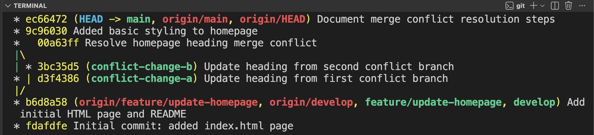

### Explanation

The conflict happened because two branches changed the same line in `index.html`. Git could not decide which change to keep, so I manually edited the file, removed the conflict markers, kept the correct final heading, staged the file, and committed the merge conflict resolution.

## Question 4: Write a Dockerfile for an Application with Optimization and Small Image Size

### Files Created

- `backend/main.py`: Simple FastAPI application that serves `frontend/index.html`.
- `backend/requirements.txt`: Contains Python dependencies.
- `frontend/index.html`: Static frontend page served by FastAPI.
- `Dockerfile`: Builds the application container image.
- `.dockerignore`: Removes unnecessary files from the Docker build context.

### Dockerfile

```dockerfile
FROM python:3.12-slim

WORKDIR /app

ENV PYTHONDONTWRITEBYTECODE=1 \
    PYTHONUNBUFFERED=1 \
    PIP_NO_CACHE_DIR=1 \
    PIP_DISABLE_PIP_VERSION_CHECK=1

RUN adduser --disabled-password --gecos "" --no-create-home appuser

COPY backend/requirements.txt .
RUN pip install -r requirements.txt

COPY --chown=appuser:appuser backend ./backend
COPY --chown=appuser:appuser frontend ./frontend

USER appuser

EXPOSE 8000

CMD ["uvicorn", "backend.main:app", "--host", "0.0.0.0", "--port", "8000"]
```

### Commands Used

```bash
docker build -t devops-practical-app .
docker run -p 8000:8000 devops-practical-app
```

### Optimization Steps

- Used `python:3.12-slim`, which is smaller than a full Python image.
- Copied only required files into the image.
- Used `.dockerignore` to exclude Git files, screenshots, logs, environment files, and dependencies.
- Set `PIP_NO_CACHE_DIR=1` to avoid storing pip cache in the image.
- Set `PIP_DISABLE_PIP_VERSION_CHECK=1` to reduce unnecessary pip output and checks.
- Set Python environment variables to avoid `.pyc` files and improve container logging.
- Created and used a non-root `appuser` for better container security.
- Used `--no-create-home` to avoid creating an unnecessary home directory for the container user.
- Used `COPY --chown=appuser:appuser` so files are owned by the non-root user.

### Proof Screenshots

Docker image build completed successfully:

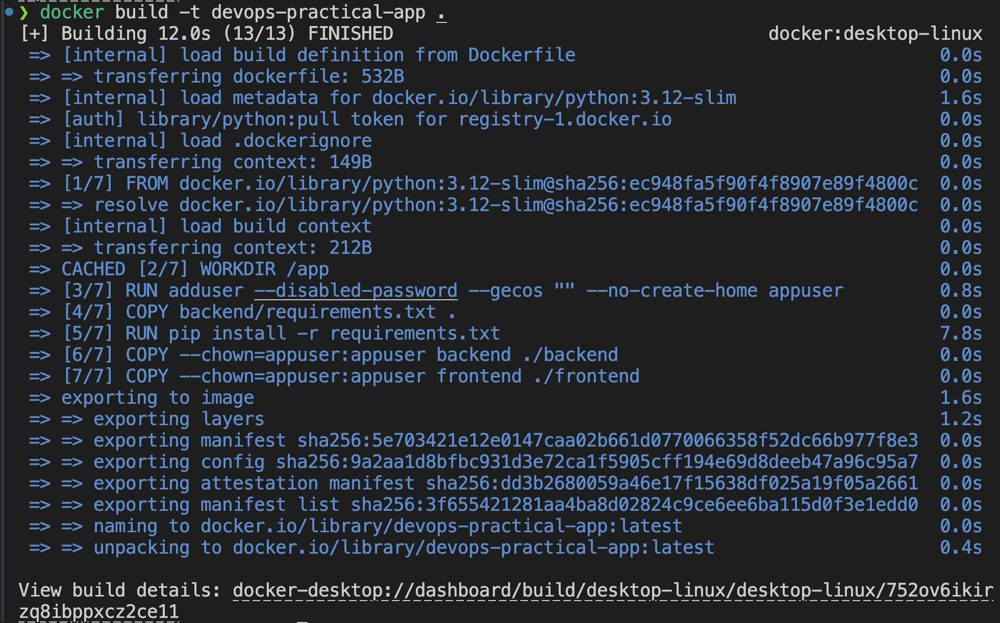

Docker container running successfully:

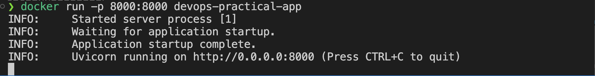

### Explanation

The Dockerfile creates a lightweight image for the FastAPI application. The app serves the static `frontend/index.html` page through `backend/main.py` on port `8000` and provides a `/health` endpoint for container checks. The image is optimized by using a slim Python base image, excluding unnecessary files, installing dependencies without cache, and running the application as a non-root user.

## Question 5: Run a Container and Debug Issue if the Application Fails to Start

### Scenario

To simulate a container startup failure, I ran the image with an incorrect FastAPI module path:

```bash
docker run --name devops-practical-fail devops-practical-app uvicorn backend.wrong:app --host 0.0.0.0 --port 8000
```

### Debugging Commands Used

```bash
docker ps -a
docker logs devops-practical-fail
docker inspect devops-practical-fail
```

### Error Found

```text
ERROR: Error loading ASGI app. Could not import module "backend.wrong".
```

### Root Cause

The container failed because the startup command used the wrong module path:

```text
backend.wrong:app
```

The actual FastAPI application is located in:

```text
backend.main:app
```

### Fix Applied

I removed the failed container and started a new container using the correct application path:

```bash
docker rm devops-practical-fail
docker run -d --name devops-practical-fixed -p 8000:8000 devops-practical-app uvicorn backend.main:app --host 0.0.0.0 --port 8000
```

Then I verified the application using the health check endpoint:

```bash
curl http://localhost:8000/health
```

Expected output:

```json
{"status":"ok"}
```

### Proof Screenshots

Container failed because of the wrong FastAPI module path:

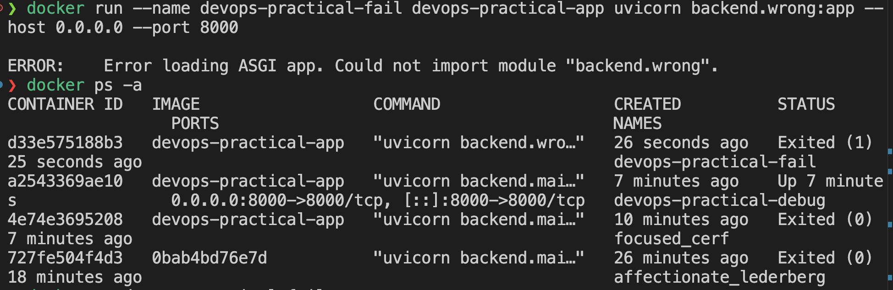

Container started successfully after using the correct module path:

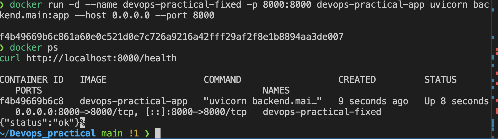

### Explanation

I used `docker ps -a` to check the stopped container, `docker logs` to view the startup error, and identified that the application module path was incorrect. After changing the command from `backend.wrong:app` to `backend.main:app`, the container started successfully and the health check returned `{"status":"ok"}`.

## Question 6: Use Docker Compose to Manage a Multi-Container Setup

### Files Created

- `docker-compose.yml`: Defines the app and database services.
- `.env.example`: Shows required database environment variables without exposing real secrets.

### Services Used

- `app`: FastAPI application built from the local `Dockerfile`.
- `database`: PostgreSQL database using the `postgres:16-alpine` image.
- `postgres_data`: Docker volume used to persist database data.

### Docker Compose File

```yaml
services:
  app:
    build: .
    container_name: devops-practical-app
    ports:
      - "8000:8000"
    environment:
      DATABASE_URL: postgresql://${POSTGRES_USER:-devops_user}:${POSTGRES_PASSWORD:-devops_password}@database:5432/${POSTGRES_DB:-devops_db}
    depends_on:
      database:
        condition: service_healthy
    restart: unless-stopped

  database:
    image: postgres:16-alpine
    container_name: devops-practical-db
    environment:
      POSTGRES_USER: ${POSTGRES_USER:-devops_user}
      POSTGRES_PASSWORD: ${POSTGRES_PASSWORD:-devops_password}
      POSTGRES_DB: ${POSTGRES_DB:-devops_db}
    volumes:
      - postgres_data:/var/lib/postgresql/data
    healthcheck:
      test: ["CMD-SHELL", "pg_isready -U $${POSTGRES_USER} -d $${POSTGRES_DB}"]
      interval: 10s
      timeout: 5s
      retries: 5
    restart: unless-stopped

volumes:
  postgres_data:
```

### Commands Used

If another container is already using port `8000`, stop it first:

```bash
docker rm -f devops-practical-fixed
```

Start the multi-container setup:

```bash
docker compose up --build
```

Check running services:

```bash
docker compose ps
```

Check logs:

```bash
docker compose logs app
docker compose logs database
```

Verify the app:

```bash
curl http://localhost:8000/health
curl http://localhost:8000/config
```

Stop the setup:

```bash
docker compose down
```

### Proof Screenshot

Docker Compose running the FastAPI app and PostgreSQL database:

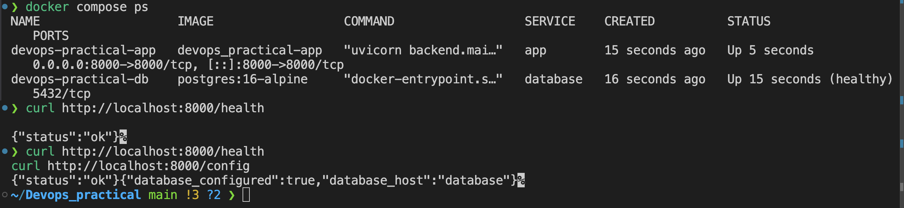

### Explanation

Docker Compose was used to manage a multi-container application. The `app` service runs the FastAPI application, and the `database` service runs PostgreSQL. The app waits for the database health check before starting because of `depends_on` with `condition: service_healthy`. The database data is stored in a named Docker volume called `postgres_data`, so data can persist even if the database container is recreated.

## Question 7: Set Up a CI Pipeline Using GitHub Actions to Build and Test Code

### Files Created

- `.github/workflows/ci.yml`: GitHub Actions workflow for continuous integration.
- `backend/test_main.py`: Unit tests for the FastAPI application.

### CI Workflow

```yaml
name: CI

on:
  push:
    branches:
      - main
      - develop
  pull_request:
    branches:
      - main
      - develop

jobs:
  build-and-test:
    runs-on: ubuntu-latest

    steps:
      - name: Checkout repository
        uses: actions/checkout@v4

      - name: Set up Python
        uses: actions/setup-python@v5
        with:
          python-version: "3.12"

      - name: Install dependencies
        run: |
          python -m pip install --upgrade pip
          pip install -r backend/requirements.txt

      - name: Run tests
        run: |
          python -m unittest discover -s backend -p "test_*.py"

      - name: Validate Docker Compose file
        run: |
          docker compose config

      - name: Build Docker image
        run: |
          docker build -t devops-practical-app .
```

### Commands Used Locally

```bash
python3 -m unittest discover -s backend -p "test_*.py"
docker compose config
```

### Proof Screenshot

GitHub Actions CI pipeline completed successfully:

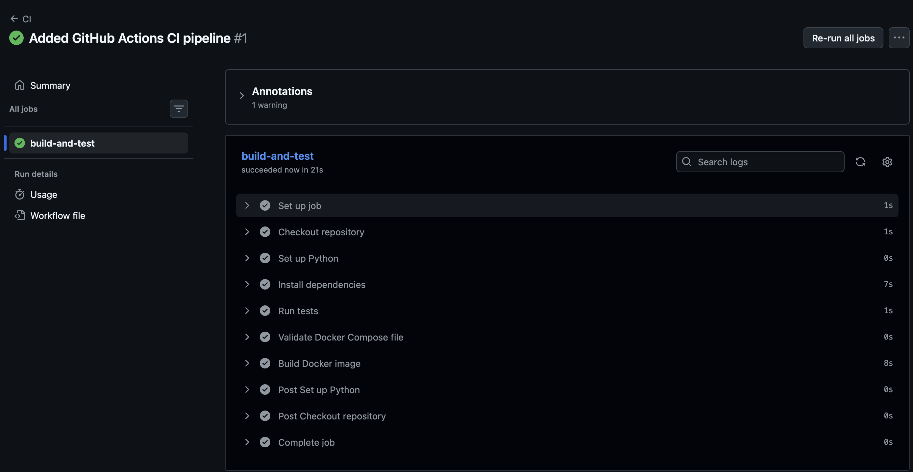

### Explanation

The CI pipeline runs automatically on pushes and pull requests to the `main` and `develop` branches. It checks out the code, installs Python dependencies, runs unit tests, validates the Docker Compose file, and builds the Docker image. This helps detect broken code, invalid Compose configuration, or Docker build failures before changes are merged.

## Question 8: Write a Bash Script to Automate a Repetitive Deployment Setup

### File Created

- `scripts/deploy.sh`: Automates the deployment setup using Docker Compose.

### Script

```bash
#!/usr/bin/env bash
set -euo pipefail

APP_URL="${APP_URL:-http://localhost:8000}"

echo "Starting deployment setup..."

if ! command -v docker >/dev/null 2>&1; then
    echo "Docker is not installed or not available in PATH."
    exit 1
fi

if ! docker info >/dev/null 2>&1; then
    echo "Docker daemon is not running. Start Docker Desktop and try again."
    exit 1
fi

if [ ! -f .env ] && [ -f .env.example ]; then
    cp .env.example .env
    echo "Created .env from .env.example."
fi

echo "Validating Docker Compose configuration..."
docker compose config >/dev/null

echo "Building and starting containers..."
docker compose up --build -d

echo "Waiting for application health check..."
for attempt in {1..10}; do
    if curl -fsS "${APP_URL}/health" >/dev/null; then
        echo "Application is healthy at ${APP_URL}/health"
        docker compose ps
        exit 0
    fi

    echo "Health check attempt ${attempt}/10 failed. Retrying..."
    sleep 3
done

echo "Application did not become healthy. Showing app logs:"
docker compose logs app
exit 1
```

### Commands Used

Make the script executable:

```bash
chmod +x scripts/deploy.sh
```

Run the deployment script:

```bash
./scripts/deploy.sh
```

### Proof Screenshot

Deployment automation script completed successfully:

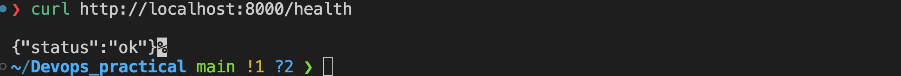

### Explanation

The script automates a repetitive deployment setup. It checks whether Docker is installed and running, creates `.env` from `.env.example` if needed, validates the Docker Compose file, builds and starts the containers, waits for the FastAPI health check, and shows logs if the application fails to become healthy.

## Question 9: Configure Environment Variables Securely for an Application

### Files Used

- `.env.example`: Template file showing required environment variables.
- `.gitignore`: Ignores the real `.env` file so secrets are not committed.
- `docker-compose.yml`: Loads environment variables into the containers.
- `backend/main.py`: Reads environment variables from the container environment.

### Environment Template

```env
APP_ENV=development
SECRET_KEY=change_this_secret_key
POSTGRES_USER=devops_user
POSTGRES_PASSWORD=change_this_password
POSTGRES_DB=devops_db
```

### Secure Setup Commands

Create a real local `.env` file from the example:

```bash
cp .env.example .env
```

Edit `.env` and replace placeholder values:

```bash
nano .env
```

Confirm `.env` is ignored by Git:

```bash
git status --short
```

Start the application with Docker Compose:

```bash
docker compose up --build
```

Verify that the app can read the environment configuration without exposing secret values:

```bash
curl http://localhost:8000/config
```

Expected output:

```json
{
  "app_environment": "development",
  "database_configured": true,
  "database_host": "database",
  "secret_key_configured": true
}
```

### Proof Screenshot

Environment variables are configured securely and `.env` is ignored by Git:

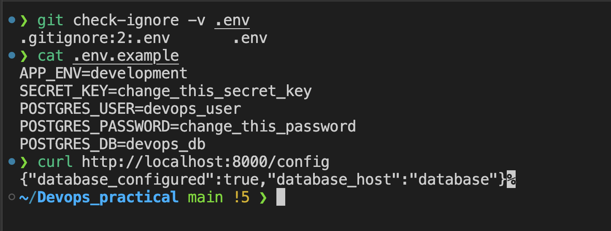

### Explanation

Sensitive values should not be hardcoded in application code or committed to GitHub. I used `.env.example` to document required variables and `.gitignore` to prevent the real `.env` file from being committed. Docker Compose loads the variables from `.env` and passes them to the application. The `/config` endpoint only confirms whether values are configured; it does not expose the actual database password or secret key.

## Question 10: Set Up Nginx as a Reverse Proxy for a Backend Service

### Files Created or Updated

- `nginx/default.conf`: Nginx reverse proxy configuration.
- `docker-compose.yml`: Added an `nginx` service.

### Nginx Configuration

```nginx
server {
    listen 80;
    server_name localhost;

    location / {
        proxy_pass http://app:8000;
        proxy_http_version 1.1;
        proxy_set_header Host $host;
        proxy_set_header X-Real-IP $remote_addr;
        proxy_set_header X-Forwarded-For $proxy_add_x_forwarded_for;
        proxy_set_header X-Forwarded-Proto $scheme;
    }
}
```

### Docker Compose Service

```yaml
nginx:
  image: nginx:1.27-alpine
  container_name: devops-practical-nginx
  ports:
    - "8080:80"
  volumes:
    - ./nginx/default.conf:/etc/nginx/conf.d/default.conf:ro
  depends_on:
    - app
  restart: unless-stopped
```

### Commands Used

Start the services:

```bash
docker compose up --build
```

Check that Nginx is running:

```bash
docker compose ps
```

Test the reverse proxy:

```bash
curl http://localhost:8080/health
curl http://localhost:8080/config
```

Check Nginx logs:

```bash
docker compose logs nginx
```

### Proof Screenshot

Nginx reverse proxy forwarding requests to the FastAPI backend:

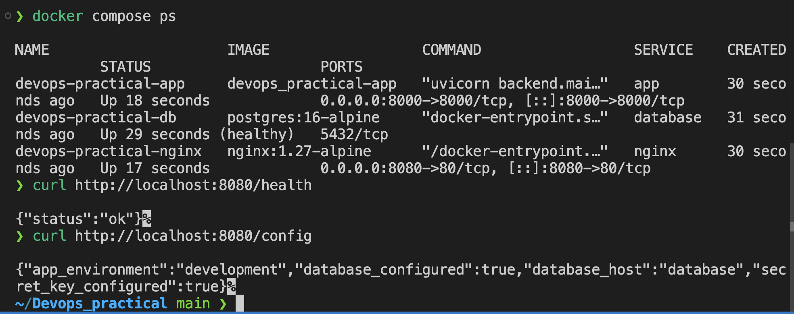

### Explanation

Nginx runs as a separate container and acts as a reverse proxy in front of the FastAPI backend. Requests sent to `localhost:8080` are received by Nginx and forwarded internally to the `app` service at `http://app:8000`. This keeps the backend behind a proxy layer and demonstrates how production traffic can be routed through Nginx.

## Question 11: Deploy a Static Frontend on Netlify

### Deployment URL

```text
https://devopspracticaltask.netlify.app
```

### Deployment Steps

1. Logged in to Netlify.
2. Created a new site.
3. Uploaded or connected the static frontend from the `frontend` folder.
4. Set the publish directory to `frontend`.
5. Deployed the site and verified it in the browser.

### Proof Screenshot

Static frontend deployed successfully on Netlify:

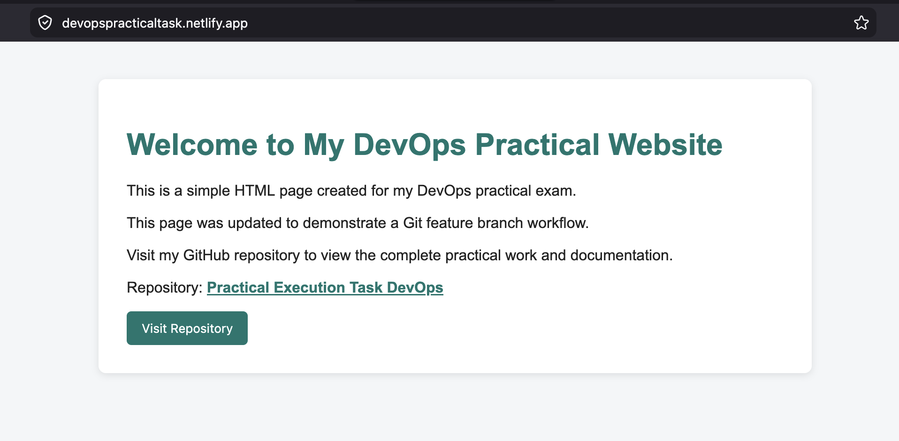

### Explanation

The static frontend was deployed on Netlify so it can be accessed publicly through a live URL. Netlify serves the `frontend/index.html` page as a static website, which is suitable for simple HTML, CSS, and JavaScript frontend deployments.

## Question 12: Analyze System/Application Logs and Identify Potential Root Cause of Failures

### File Created

- `logs-analysis.md`: Contains log analysis notes, observations, possible root causes, and fixes.

### Commands Used

```bash
docker compose ps
docker compose logs app
docker compose logs nginx
docker compose logs database
```

### Application Log Observations

The FastAPI app logs showed successful startup:

```text
Started server process
Application startup complete
Uvicorn running on http://0.0.0.0:8000
```

The app also showed successful requests:

```text
GET /health HTTP/1.1 200 OK
GET /config HTTP/1.1 200 OK
```

### Nginx Log Observations

The Nginx logs showed that the reverse proxy started successfully and forwarded requests:

```text
Configuration complete; ready for start up
GET /health HTTP/1.1 200
GET /config HTTP/1.1 200
```

### Potential Root Causes

If the application fails, possible causes include:

- FastAPI backend container is stopped or unhealthy.
- Nginx is not running.
- Nginx `proxy_pass` points to the wrong service or port.
- Port `8080` or `8000` is already in use.
- Database container is not healthy.
- Required environment variables are missing.

### Identified Result

The logs showed successful startup and `200 OK` responses, so there was no current application failure. A harmless Nginx startup notice appeared because the mounted config file is read-only, but Nginx still started correctly and served requests.

### Explanation

I analyzed logs using `docker compose logs` for the app, Nginx, and database services. The logs helped confirm that containers started correctly and requests were successfully handled. If a failure occurred, these logs would help identify whether the issue was caused by the application, reverse proxy, database, port conflict, or missing environment variables.
